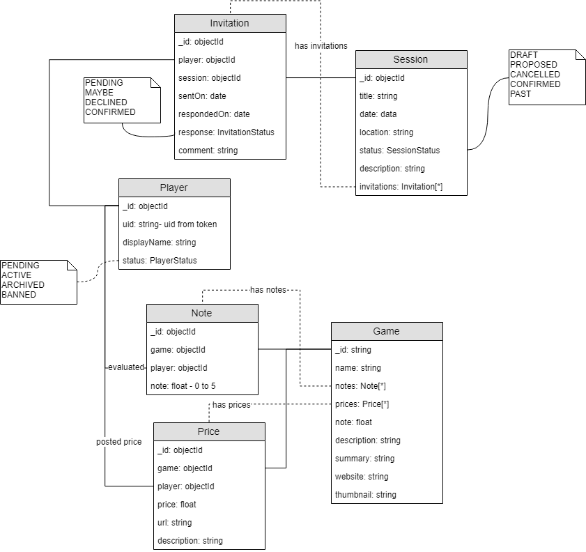

# MIMIR

## Models



## Use Cases

- **A new player register.**
  - The player creates an account using the MIMIR front-end. The front-end is the only way to create an account as it is the sole origin accepted for Firebase authentication.
  - The player account is created on MIMIR database using the uid in the ID Token generated when signin in with Firebase from MIMIR front-end. The account also requires a unique display name.

- **A player wants to plan a new session**
  - The player logs in with Firebase.
  - The player uses the token to create a new session, the front-end calls the `POST /sessions` route. A session has a date, location and title.
  - The organisator can invite other players to this session, or declare it as public, in this case it will be listed in front-end calendar.
  - The organisator invites new player (also available for public sessions to trigger notifications)

- **A player was invited to a session**
  - The player gets notified via the configured media (discord, mail).
  - The player logs in with Firebase.
  - The player sees the session in the front and the pending invitation. The front-end calls the `GET /players/:playerId/invitations` route.
  - The player accepts the invitation via the `PUT /invitations/:invitationId ?response=CONFIRMED` route. Response could be PENDING, MAYBE, DECLINED, CONFIRMED.

## Development

### Structure

```
.
├── docs
│   ├── resources
│   └── Output doc files (openapi.yml, etc.)
├── src
│   ├── controllers
│   │   ├── games - actions related to games
│   │   │   ├── controller errors definitions
│   │   │   └── Controller files for use-cases. Split them into action types if necessary.
│   │   └── invitations - actions related to session invitations
│   │       ├── controller errors definitions
│   │       └── Controller files for use-cases. Split them into action types if necessary.
│   │   └── players - actions related to players
│   │       ├── controller errors definitions
│   │       └── Controller files for use-cases. Split them into action types if necessary.
│   │   └── sessions - actions related to sessions
│   │       ├── controller errors definitions
│   │       └── Controller files for use-cases. Split them into action types if necessary.
│   ├── middlewares
│   │   ├── authentication.middleware.js - Middlewares for authentication.
│   │   ├── authorizaion.middleware.js - Middlewares for permissions.
│   │   ├── locals.middleware.js - Create request local context.
│   │   ├── logger.middleware.js - Create request logger context, plug in on-end request log.
│   │   └── Other Middlewares for express routers.
│   ├── models
│   │   └── Database models.
│   ├── routes
│   │   └── Express routers.
│   ├── services
│   │   └── Layers to interact with models. Might not be used at first, put logic in controllers.
│   ├── utils
│   │   └── Errors, prettifiers, etc.
│   └── app.js
└── README.md
```

### BUILD

If you have docker installed:
- Build docker image: `docker build -t nakasar/mimir-api .  `
- Run container: `docker run -p 8080:80 -d --name mimir-api nakasar/mimir-api`

If you want to activate let's encrypt automated certificate and if you are running on a docker enviromnemt with shared resources with docker nginx companion:
Add the following variables to your container (and do not expose any port):
```
VIRTUAL_HOST=domain.example.com
LETSENCRYPT_HOST=domain.example.com
LETSENCRYPT_EMAIL=your_email
--network=webproxy 
```

 `docker run -e VIRTUAL_HOST=domain.example.com -e LETSENCRYPT_HOST=domain.example.com -e LETSENCRYPT_EMAIL=your_email --network=webproxy -d --name mimir-api nakasar/mimir-api`
